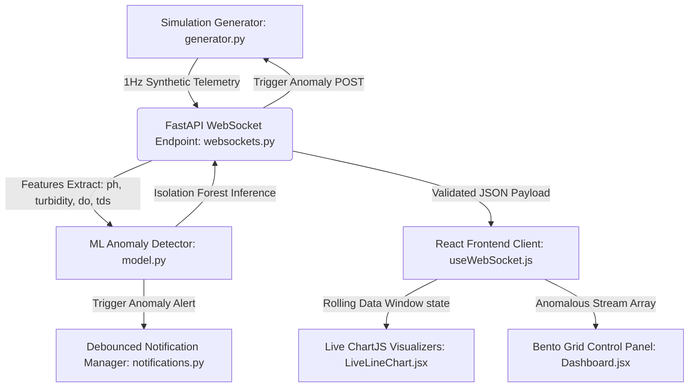

# AquaFlow Sentinel
### *An Intelligent IoT-Edge Water Quality Surveillance & Real-Time Contamination Detection System for Municipal Governance*

---

## 1. Abstract / Project Overview
In municipal water governance, ensuring the delivery of safe drinking water compliant with national standards (e.g., **BIS IS:10500** in India) requires high-frequency, reliable, and automated telemetry systems. Traditional manual testing is labor-intensive and suffers from high latency, delaying intervention during contamination events.

**AquaFlow Sentinel** is a full-stack, research-grade IoT prototype designed for Urban Local Bodies (ULBs) to monitor water quality parameters in real-time. The system leverages high-frequency WebSockets to stream simulated sensor data and executes on-the-fly anomaly detection using a machine learning classifier. By utilizing an **Isolation Forest** model, the platform detects multi-parameter contamination outliers without relying on hardcoded rules, auto-recovers when conditions normalize, outputs official government-style alerts, and generates verified CSV reports for municipal archiving.

---

## 2. System Architecture & Telemetry Pipeline

The platform uses a decoupled, event-driven architecture designed to minimize latency and handle high-throughput telemetry streams:



### Components Summary:
1. **IoT Simulation Engine (`generator.py`)**: Generates multivariate normal distribution sensor samples modeling water parameters. Includes a stateful trigger to inject simulated contamination anomalies (pH drops, turbidity spikes, DO drops, TDS spikes).
2. **FastAPI Backend Pipeline (`websockets.py`, `main.py`)**: Hosts WebSocket servers streaming data at 1.0 Hz, binds incoming values to strict schemas (`Pydantic`), feeds features to the ML classifier, and manages API control endpoints.
3. **Machine Learning Classifier (`model.py`, `train.py`)**: Implements a scikit-learn `Isolation Forest` model trained on 5,000 baseline "normal" samples to output outlier classifications (`1` for nominal, `-1` for anomaly).
4. **Debounced Advisory Alerts (`notifications.py`)**: Monitors ML results and logs official municipal advisory notifications. Features a 30-second timestamp debounce to prevent console flooding.
5. **Utilitarian SCADA Frontend (`Dashboard.jsx`, `LiveLineChart.jsx`)**: Built with React, Tailwind CSS, and Chart.js. Features a high-contrast municipal light theme, Bento Grid cards, internal scrolling consoles, and client-side CSV compliance report generators.

---

## 3. Machine Learning Methodology: Isolation Forest
Traditional thresholding alerts fail when multiple parameters degrade slightly but stay within individual limits. The Sentinel platform implements an **Isolation Forest** unsupervised algorithm.

### Training (`train.py`):
- **Features**: $\mathbf{x} = [\text{pH}, \text{Turbidity}, \text{DO}, \text{TDS}]^T \in \mathbb{R}^4$.
- **Normal Baseline Generator**: Generates 5,000 synthetic observations drawing from independent Gaussian distributions matching historical potable water profiles:
  - $\text{pH} \sim \mathcal{N}(7.2, 0.15)$
  - $\text{Turbidity} \sim \mathcal{N}(0.5, 0.05)$ (strict BIS compliance)
  - $\text{Dissolved Oxygen (DO)} \sim \mathcal{N}(8.0, 0.25)$
  - $\text{Total Dissolved Solids (TDS)} \sim \mathcal{N}(300, 20)$
- **Model Parameterization**:
  - `contamination = 0.0001`: Set extremely low to minimize false positives under normal conditions while preserving high sensitivity to actual multi-parameter shifts.
  - `n_estimators = 100`: Balance between tree representation and real-time execution speeds.
  - Saved using `joblib` for rapid reload during API boot.

### Inference (`model.py`):
In real-time, the incoming raw JSON sample is parsed, structured into a single-row Pandas DataFrame (matching feature column names to prevent fitting warnings), and scored:
$$\text{Score}(\mathbf{x}) = \text{Isolation Forest Prediction}(\mathbf{x})$$
If $\text{Score}(\mathbf{x}) = -1$, the sample is flagged as an outlier (`ml_anomaly = True`).

---

## 4. Regulatory Compliance Framework (BIS IS:10500)
The visual dashboard directly prints standard regulatory thresholds under each chart to ensure immediate operator validation:

| Parameter | Measurement Unit | BIS IS:10500 Acceptable Limit | BIS IS:10500 Permissible Limit | Operational Normal Target |
| :--- | :--- | :--- | :--- | :--- |
| **pH** | pH Units | 6.5 – 8.5 | No Relaxation | ~7.2 |
| **Turbidity** | NTU | Max 1.0 NTU | 5.0 NTU | ~0.5 NTU |
| **TDS** | mg/L | Max 500 mg/L | 2000 mg/L | ~300 mg/L |
| **Dissolved Oxygen** | mg/L | *No BIS Limit (Network Health)* | - | ~8.0 mg/L |

---

## 5. Directory Structure
```
water-monitoring-prototype/
│
├── backend/
│   ├── app/
│   │   ├── api/
│   │   │   └── websockets.py        # WS logic, ML scoring integration
│   │   ├── core/
│   │   │   └── notifications.py     # Debounced mock email alerts
│   │   ├── ml/
│   │   │   ├── saved_model.joblib   # Trained model serialization
│   │   │   ├── model.py             # Inference class wrapper
│   │   │   └── train.py             # Baseline generation & training script
│   │   ├── schemas/
│   │   │   └── sensor_data.py       # Pydantic data schemas
│   │   ├── simulation/
│   │   │   └── generator.py         # Stateful normal/contaminated simulator
│   │   └── main.py                  # FastAPI app startup & CORS configuration
│   ├── requirements.txt             # Backend dependencies
│   └── venv/                        # Python virtual environment
│
└── frontend/
    ├── src/
    │   ├── components/
    │   │   ├── charts/
    │   │   │   └── LiveLineChart.jsx # Chart.js configuration, styling
    │   │   ├── ControlPanel.jsx     # Trigger POST, CSV exporter
    │   │   └── MLAlertPanel.jsx     # AI security alerts (deprioritized)
    │   ├── hooks/
    │   │   └── useWebSocket.js      # WebSocket state manager hook
    │   ├── pages/
    │   │   └── Dashboard.jsx        # Industrial Bento Grid page
    │   ├── index.css                # Global styles, scrollbar styling
    │   └── main.jsx                 # App entry point
    └── package.json                 # Frontend dependencies
```

---

## 6. Installation & Execution

### Prerequisites:
- Python 3.10+
- Node.js 18+

### Step A: Backend Setup & Startup
1. Navigate to the backend directory:
   ```bash
   cd backend
   ```
2. Create and activate a Python virtual environment:
   ```bash
   python -m venv venv
   # On Windows:
   .\venv\Scripts\activate
   # On Unix/macOS:
   source venv/bin/activate
   ```
3. Install dependencies:
   ```bash
   pip install -r requirements.txt
   ```
4. Train the Isolation Forest model (this generates the `saved_model.joblib` file):
   ```bash
   python app/ml/train.py
   ```
5. Start the FastAPI application:
   ```bash
   python -m uvicorn app.main:app --reload --port 8000
   ```

### Step B: Frontend Setup & Startup
1. Navigate to the frontend directory:
   ```bash
   cd ../frontend
   ```
2. Install Node packages:
   ```bash
   npm install
   ```
3. Start the Vite development server:
   ```bash
   npm run dev
   ```
4. Open your browser and navigate to `http://localhost:5173/` (or the port specified in your console).

---

## 7. Future Research Extensions
To advance this prototype for formal research publication, we suggest the following implementations:
1. **Explainable AI (XAI)**: Integrate SHAP (SHapley Additive exPlanations) or LIME on the backend to append local feature contributions to the WebSocket packet when `ml_anomaly = True`. This lets operators see exactly *why* a particular parameter combination was classified as contaminated.
2. **Active Learning Feedback Loop**: Add a manual "Override False Positive" button in the frontend. When clicked, the payload should be sent to a backend SQLite store to retrain the Isolation Forest model dynamically, optimizing classifier boundary calibration.
3. **Data Drift Monitoring**: Add a drift detection algorithm (e.g., Kolmogorov-Smirnov test) running every 1,000 samples to notify administrators when seasonal changes (such as natural summer TDS increases) require retraining the baseline model.
